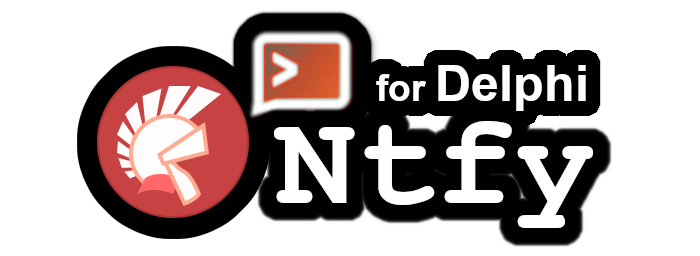

<div align="center">
  
</div>

 Ntfy was made by [Philipp C. Heckel](https://github.com/binwiederhier). Consider leaving a star on [his project](https://github.com/binwiederhier/ntfy). As [Philipp C. Heckel](https://github.com/binwiederhier) stated, this service will stay free, so any kind of support to afford costs help with cloud hosting will be warmly received. You can also self-host ntfy server. Visit [docs.ntfy.sh](https://docs.ntfy.sh/) to get started with documentation.

## 🔔 Ntfy for Delphi 

Ntfy for Delphi it's a friendly library to work with [ntfy.sh](https://docs.ntfy.sh/) servers in Delphi. Allows you publishing messages and subscribing to topics to receive instant notifications. 

## ⚙️ Manual Installation

You need to add ```src``` folder to your library path or search path. 

## ⚙️ Boss Installation

Boss is a dependecy manager for Delphi created by [Hashload](https://github.com/HashLoad) community. 

```
  boss install github.com/hazzelnuts/ntfy-for-delphi
```

## ⚡️ Quickstart

Push a notification on a specific topic. Topics are the same as channels and the name you choose will become a public url, so remember to make difficult to guess it.

``` pascal

uses
  Notify;

begin
  Ntfy.Notification(
    New.Notification
      .Topic('your-very-secret-topic')
      .Title('⚾ Go to the game')
      .MessageContent('Tomorrow at 10:00hs ') 
  );

  Ntfy.Publish;
end;

```

## 💬 Subscribe to a topic

You can subscribe to a topic through several ways. For instance, the [Web App](https://ntfy.sh/app), [Android](https://docs.ntfy.sh/subscribe/phone/), [CLI](https://docs.ntfy.sh/subscribe/cli/) or you can use this library as follows: 

``` pascal
uses
  Notify;

begin
  Ntfy.Subscribe('your-very-secret-topic', 
    procedure (AEvent: INotifyEvent)
    begin
      WriteLn('You received a message: ' +  AEvent.MessageContent)
    end);
end;

```

There is a [VCL Sample](https://github.com/p-samuel/delphi-notify/tree/main/sample/vcl) demonstration showing you how to utilize the subscription mechanism into your project.

## ⚙️ Supported Version & Platforms

</img>
</img>
</img>
</img>

## 🔗 Dependencies

Ntfy for Delphi uses a few libraries in the messages subscription and publishing mechanism. There is no need to install. The respective credit adviced.

* [NxHorizon](https://github.com/dalijap/nx-horizon) by Dalija Prasnikar. 
* [JsonToDelphiClass](https://github.com/PKGeorgiev) by Petar Georgiev.
* [NetHTTP](https://docwiki.embarcadero.com/RADStudio/Rio/en/Using_an_HTTP_Client) native components.
* [Indy10](https://github.com/IndySockets/Indy) by IndySockets. (optional)


## 📚 Wiki

Check out the [wiki](https://github.com/hazzelnuts/ntfy-for-delphi/wiki) page for specific instructions or tutorials.

## 🌱 Consider Contributing

Ntfy for Delphi it's an open source project under the MIT license. Feel free to use or contribute! 