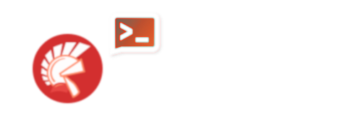

# Console Samples 
 
 Visit [ntfy.sh](https://docs.ntfy.sh/) to get started with documentation. Ntfy was made by [Philipp C. Heckel](https://github.com/binwiederhier) as an open source project. Consider leaving a star in this awesome project at [github](https://github.com/binwiederhier/ntfy).

 

  

# Delphi Ntfy 

Delphi Ntfy it's a friendly client interface to work with [ntfy.sh](https://docs.ntfy.sh/) endpoints in Delphi.

