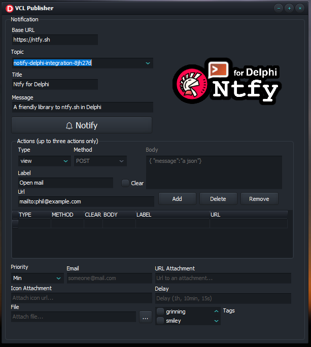

  

# VCL Samples (Publishing) 🧪

Compile this project and explore the VCL sample that has been prepared to demonstrate how publishing messages works.

  

Also check this [link](https://github.com/p-samuel/delphi-notify/tree/dev-psamuel/sample/console/publisher) for some interesting resources. 

## ⚠ Observations
You must have SSL libraries in order to run this project.
