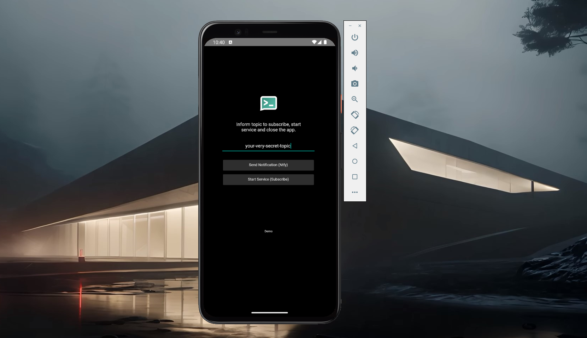
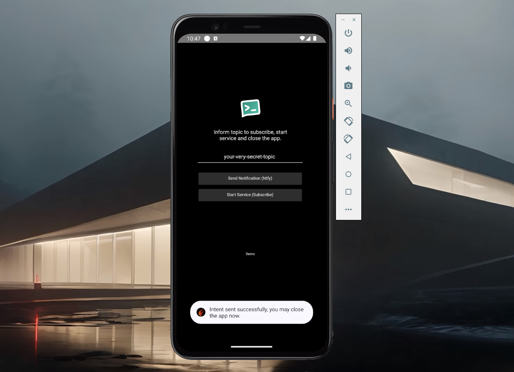
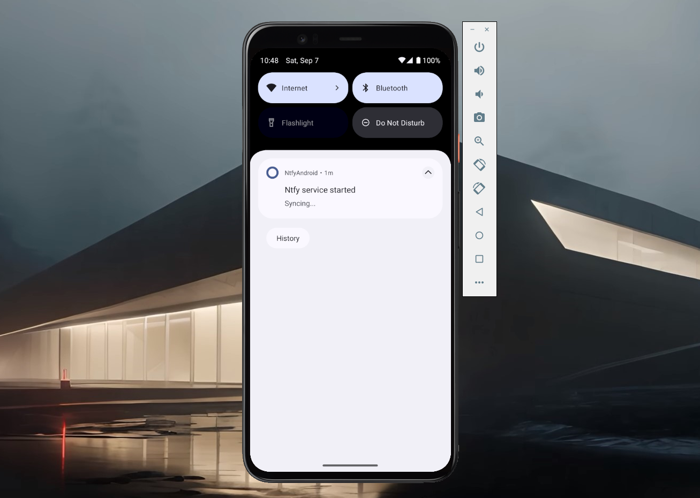
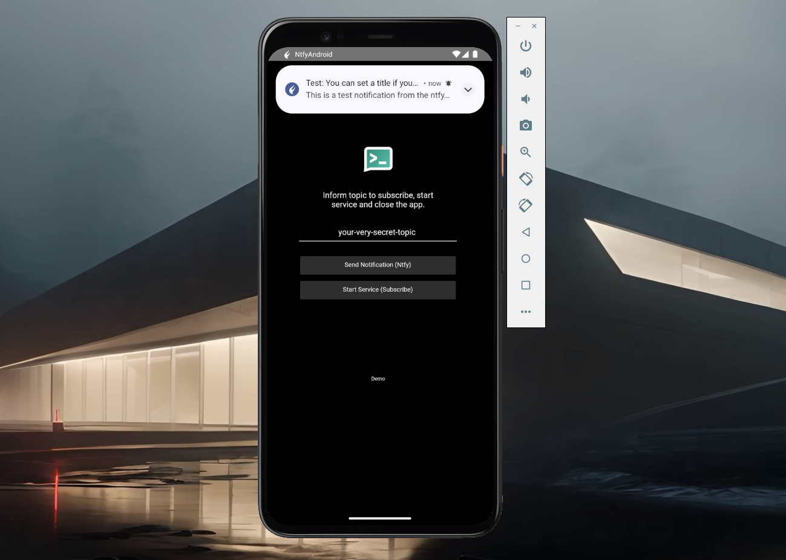

# Android 

Compile and explore the Android FMX Demo. Also check this [link](https://github.com/p-samuel/delphi-notify/tree/dev-psamuel/sample/console/publisher) for other resources. 

  
  
  
  

## Notes

This demo brings only the essential methods you may need to implement the publisher and subscriber in your project. It was developed on Delphi 12 and comes with Skia enabled.
