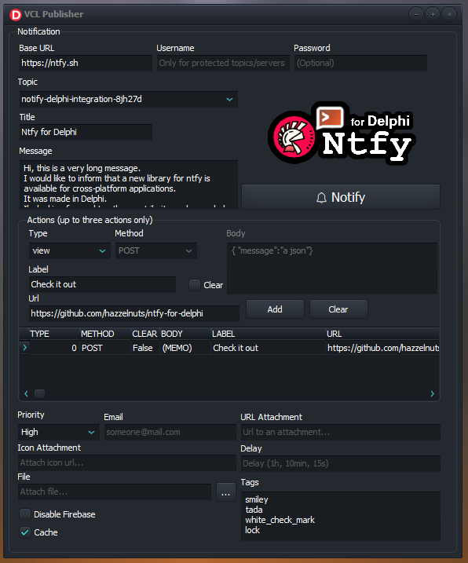

<div align="center">

# Publisher VCL Sample

</div>

Compile and explore the VCL sample. Also check this [link](https://github.com/p-samuel/delphi-notify/tree/dev-psamuel/sample/console/publisher) for other resources. 

<div align="center">
  
</div>

## Self-hosted server (optional for this sample)
Install Docker on your machine and run these steps:

``` cmd
cd delphi-notify\tests
docker compose create
docker cp server.yml ntfy:/etc/ntfy
docker compose up
```