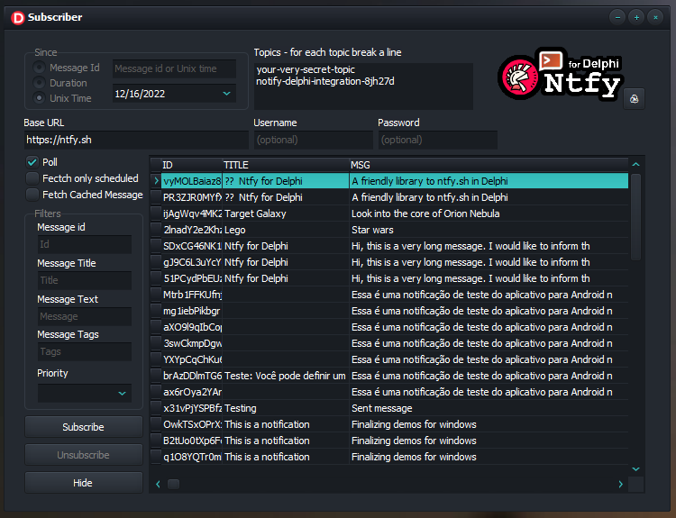

<div align="center">

# Subscriber VCL Sample

</div>

Compile and explore the VCL sample. Also check this [link](https://github.com/p-samuel/delphi-notify/tree/dev-psamuel/sample/console/publisher) for other resources. 

<div align="center">
  
</div>


## How to subscribe

Subscription is event based.

``` pascal
uses
  Notify;

begin
  Ntfy.Subscribe('your-very-secret-topic', 
    procedure (AEvent: INotifyEvent)
    begin
      ShowMessage('You received a message: ' + AEvent.Title)
    end);
end;
```

You can define your own callback procedure and use to perform other operations every time a notification is fired. 

``` pascal
uses
  Notify;

  procedure YourCallBackProcedure(AEvent: INotifyEvent);
  begin
    DoSomethingWith(AEvent);
  end;

begin
  Ntfy.Subscribe('your-very-secret-topic', YourCallBackProcedure);
end;
```

## ⚙ Self-hosted server (optional for this sample)
Install Docker in your machine and run these commands after:

``` cmd
cd delphi-notify\tests
docker compose create
docker cp server.yml ntfy:/etc/ntfy
docker compose up
```